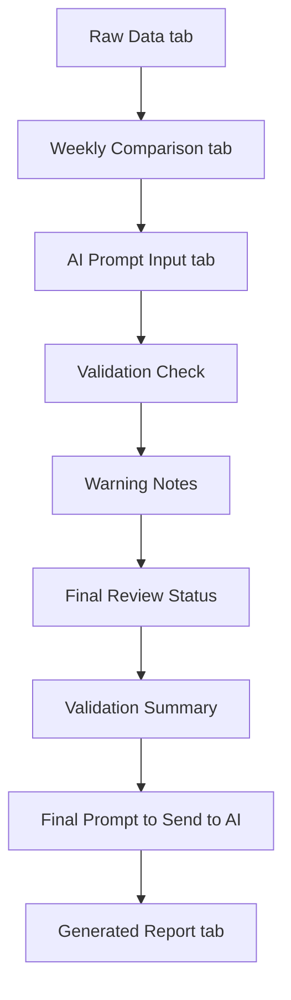
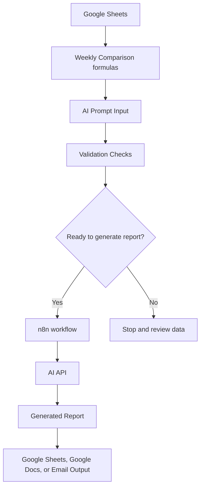

# Workflow Diagram

## Purpose
This file shows the current and planned workflow for the AI Marketing Performance Report Generator.

The goal is to explain how marketing performance data moves from raw input to weekly comparison, validation, AI prompt creation, and eventual report generation.

## Current Spreadsheet Workflow

## Planned Automated Workflow

## Notes
The current version is still a spreadsheet prototype.

The future version will use n8n to read the spreadsheet data, check whether the report is ready, send the prompt or JSON payload to an AI model, and save the generated report output.
