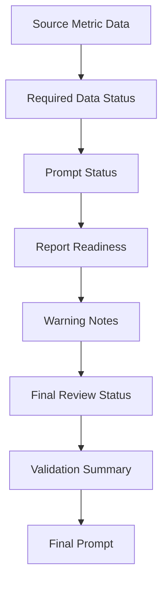
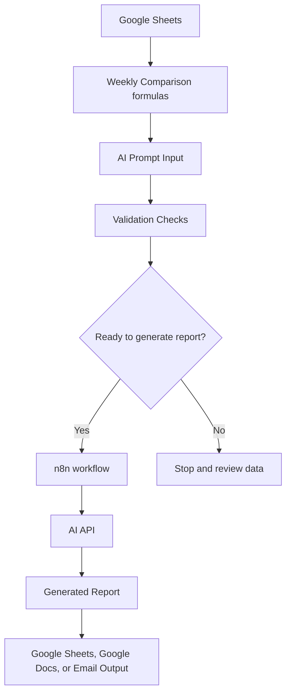

# Workflow Diagram

## Purpose

This file shows the current and planned workflow for the AI Marketing Performance Report Generator.

The goal is to explain how marketing performance data moves from raw input to weekly comparison, validation, AI prompt creation, and eventual report generation.

This workflow also shows the validation gate that helps prevent a polished report from being generated when required data is missing or when unusual metric changes need review.

## Current Spreadsheet Workflow

## Current Workflow Explanation

1. Weekly marketing data is entered into the Raw Data tab.
2. The Weekly Comparison tab pulls values from Raw Data.
3. The spreadsheet calculates numeric changes and percentage changes.
4. The AI Prompt Input tab converts the comparison data into plain-English prompt lines.
5. Validation checks confirm whether required metric data is present.
6. Warning notes flag unusual changes in traffic, conversions, or CTA clicks.
7. Final Review Status determines whether the report is ready to generate.
8. Validation Summary is added to the final prompt.
9. The final prompt can be used to generate a weekly marketing performance report.
10. A sample report output is stored in the Generated Report tab.

## Validation Gate

The validation gate checks whether the data and prompt inputs are ready before report generation.

## Validation Gate Explanation

The validation gate helps prevent the workflow from generating a polished report when the source data is incomplete or unusual changes need review.

Current validation logic includes:

- Required Data Status checks whether the main metric data is present.
- Prompt Status checks whether the final prompt source fields are ready.
- Report Readiness determines whether the report can move forward.
- Warning Notes flag unusual metric changes.
- Final Review Status confirms whether the report is ready to generate.
- Validation Summary adds the readiness status into the final prompt.

This structure makes the workflow safer because the final prompt is based on source fields and validation status instead of only relying on the final prompt cell itself.

## Planned Automated Workflow

## Planned Automation Explanation

1. n8n reads the weekly performance data from Google Sheets.
2. n8n checks whether the report is ready to generate.
3. If required data is missing or warnings need review, the workflow stops or sends a review notice.
4. If the data is ready, n8n sends the prompt or structured JSON payload to an AI model.
5. The AI model returns a generated marketing performance report.
6. n8n saves or sends the report output to Google Sheets, Google Docs, or email.

## Why This Workflow Matters

This workflow shows how a manual marketing reporting process can become more structured, repeatable, and automation-ready.

It also separates the reporting process into clear stages:

- Data entry
- Metric comparison
- Prompt preparation
- Validation
- Warning review
- Report generation
- Future automation

The current version is still a spreadsheet prototype.

The future version will use n8n to read the spreadsheet data, check whether the report is ready, send the prompt or JSON payload to an AI model, and save the generated report output.
